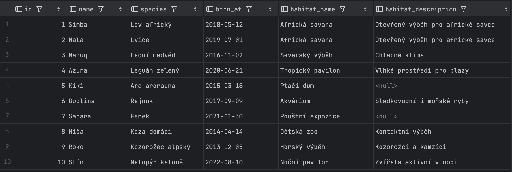
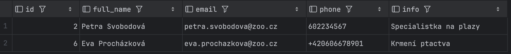
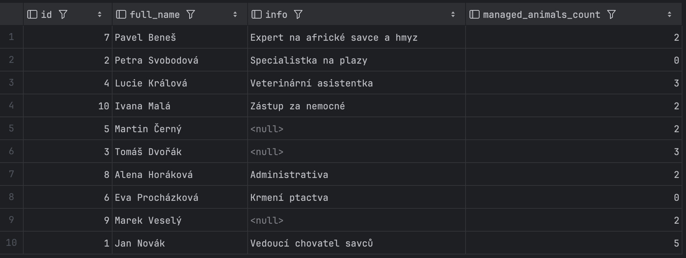

## Databázové pohledy

Tato sekce dokumentace popisuje databázové pohledy vytvořené pro zjednodušení práce s daty v systému správy zoologické zahrady.

### v_caretakers_full_name

```postgresql
CREATE VIEW v_caretakers_full_name AS
SELECT
    *,
    concat(first_name, ' ', last_name) AS full_name
FROM caretakers;
```

Pomocný pohled, který rozšiřuje tabulku ošetřovatelů o sloupec s celým jménem. Spojení křestního jména a příjmení je v aplikaci často potřeba, a proto je výhodné mít tento výpočet na jednom místě. Pohled je využíván jako základ pro další složitější pohledy a dotazy, například při hledání nejzkušenějšího veterináře podle počtu provedených ošetření.


### v_animals_with_habitat

```postgresql
CREATE VIEW v_animals_with_habitat AS
SELECT
    a.id,
    a.name,
    a.species,
    a.born_at,
    h.name as habitat_name,
    h.description as habitat_description
FROM animals a
LEFT JOIN habitats h
    ON a.habitat_id = h.id;
```

Pohled zobrazující zvířata společně s informacemi o jejich výběhu. Díky použití LEFT JOIN jsou zahrnuty i případná zvířata bez přiřazeného výběhu. Pohled usnadňuje získání kompletního přehledu o umístění zvířat v zoo bez nutnosti opakovaného psaní JOIN klauzule.



### v_caretakers_with_animals

```postgresql
CREATE VIEW v_caretakers_with_animals AS
SELECT
    c.id as caretaker_id,
    c.full_name as caretaker_name,
    c.info as caretaker_info,
    c.email,
    c.phone,
    a.name as managed_animal_name,
    a.species as managed_animal_species,
    h.name as animal_habitat_name
FROM v_caretakers_full_name c
LEFT JOIN animal_caretaker ac
    ON c.id = ac.caretaker_id
LEFT JOIN animals a
    ON a.id = ac.animal_id
LEFT JOIN habitats h
    ON h.id = a.habitat_id;
```

Komplexní pohled propojující ošetřovatele s jejich přiřazenými zvířaty včetně informací o výběhu. Díky LEFT JOIN jsou zahrnuti i ošetřovatelé, kteří aktuálně nemají přiřazené žádné zvíře. Pohled je využíván při ověřování přiřazení nového zvířete k ošetřovateli, jak ukazuje první scénář při kontrole, zda byl Pavel úspěšně přiřazen k zebře Márty.


### v_caretakers_without_animals

```postgresql
CREATE VIEW v_caretakers_without_animals AS
SELECT
    caretaker_id as id,
    caretaker_name as full_name,
    email,
    phone,
    caretaker_info as info
FROM v_caretakers_with_animals
WHERE managed_animal_name IS NULL;
```

Pohled filtrující ošetřovatele, kteří momentálně nemají přiřazené žádné zvíře. Slouží k rychlému zjištění dostupných pracovníků, kteří mohou převzít péči o nové zvíře nebo provést ad-hoc úkoly jako krmení či ošetření. V prvním scénáři je použit při hledání vhodného ošetřovatele pro nově příchozí zebru, v druhém scénáři pro nalezení volného ošetřovatele pro krmení lva Simby.



### v_caretaker_responsibilities

```postgresql
CREATE VIEW v_caretaker_responsibilities AS
SELECT
    c.id,
    c.full_name,
    c.info,
    COUNT(ac.caretaker_id) as managed_animals_count
FROM v_caretakers_full_name c
LEFT JOIN animal_caretaker ac
    ON ac.caretaker_id = c.id
GROUP BY
    c.id,
    c.full_name,
    c.info;
```

Pohled zobrazující vytíženost jednotlivých ošetřovatelů podle počtu přiřazených zvířat. Umožňuje rovnoměrné rozdělování práce a identifikaci přetížených či naopak nevytížených zaměstnanců. V prvním scénáři je využit pro nalezení ošetřovatele s nízkou vytížeností poté, co volní ošetřovatelé nebyli vhodní pro zebru z důvodu jiné specializace.



### v_treatments_detail

```postgresql
CREATE VIEW v_treatments_detail AS
SELECT
    t.id as treatment_id,
    t.administered_at,
    t.medication_qty_used,
    m.name as medication_name,
    t.notes as procedure_notes,
    c.full_name as caretaker_name,
    a.name as animal_name,
    a.species as animal_species,
    a.born_at as animal_born_at
FROM treatments t
INNER JOIN animals a
    ON t.animal_id = a.id
INNER JOIN v_caretakers_full_name c
    ON t.caretaker_id = c.id
INNER JOIN medications m
    ON t.medication_id = m.id;
```

Detailní pohled na provedená veterinární ošetření. Spojuje informace o ošetření s údaji o zvířeti, ošetřovateli a použitém léku do jednoho přehledného výstupu. Na rozdíl od předchozích pohledů používá INNER JOIN, protože ošetření bez platných referencí by nemělo existovat. Pohled je využíván pro ověření úspěšně provedených zákroků, jak demonstruje druhý scénář při kontrole uspání a dezinfekce rány lva Simby.


### v_feeding_event_detail

```postgresql
CREATE VIEW v_feeding_event_detail AS
SELECT
    f.id as feeding_event_id,
    f.fed_at,
    i.name as feed_type_name,
    f.feed_item_qty_used as qty_used,
    f.notes as feeding_notes,
    c.full_name as caretaker_name,
    a.name as animal_name,
    a.species as animal_species,
    a.born_at as animal_born_at
FROM feeding_events f
INNER JOIN animals a
    ON f.animal_id = a.id
INNER JOIN v_caretakers_full_name c
    ON f.caretaker_id = c.id
INNER JOIN feed_items i
    ON f.feed_item_id = i.id;
```

Detailní pohled na události krmení analogický k pohledu na ošetření. Poskytuje kompletní informace o každém krmení včetně údajů o zvířeti, ošetřovateli a použitém krmivu. Používá INNER JOIN ze stejného důvodu jako pohled na ošetření. Druhý scénář tento pohled využívá pro ověření, že krmení lva Simby bylo správně zaznamenáno, včetně poznámky o nalezené ráně.

